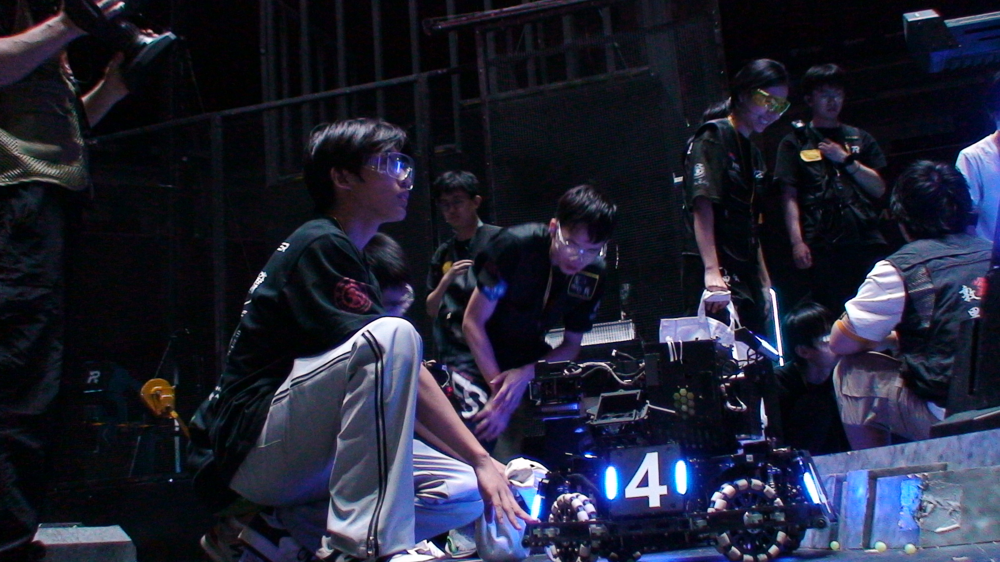
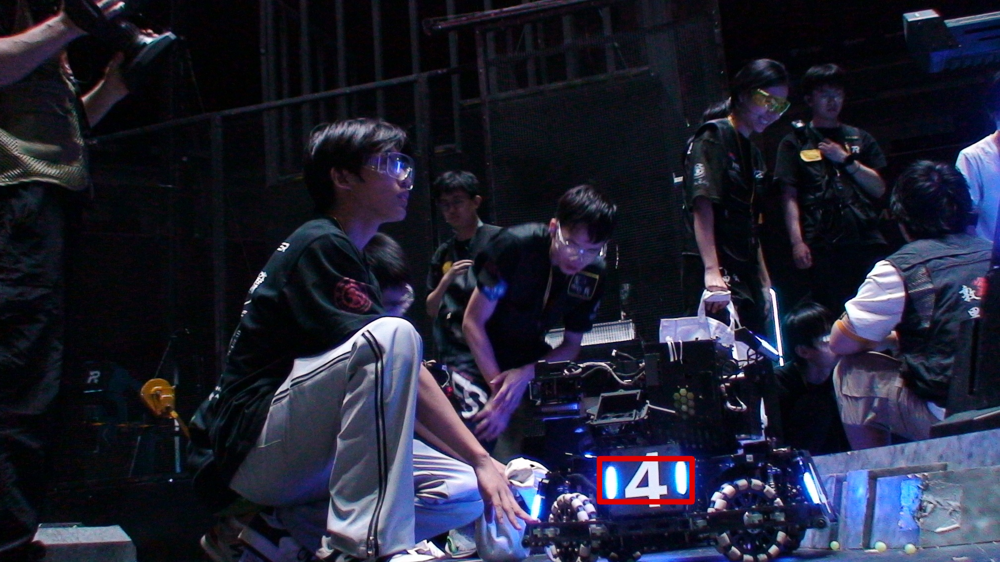

# RMVtask 02
## Final result showcase

## 项目澄清
上述图片是最终的成果。个人觉得还是不错的。
本次的项目自2025/9/18日晚至9/19晚共历时1天，并且成功实现了一次迭代：在成功框选出两个灯条的基础上（1.0版本，**main_1.cpp**），成功实现了配对取并集从而框出整个装甲板的效果即2.0版本（**main.cpp**）。
或许您从main_1.cpp的一些注释中尚可看出其一开始是对着测试图片（那朵花）编写的些许痕迹。
以及一些pdf中要求的操作，均在**main_1.cpp**极其注释中有体现。
然而，最终并未采纳的操作有：
- 均值模糊和高斯模糊同时使用。（经过尝试，这样的效果并不如单独使用高斯模糊）
- 漫水处理，这是因为未能找到一个合适的**seedPoint**。（这点会在后续的**2.1**版本中更新），届时这一行会被划除。
- 绘制任意的圆形，文字（与主线任务无关，后续将在**1.1**版本中以注释的方式更新。）
- 图像旋转35°，图像裁剪为原图的左上角*1/4。（与主线任务无关，后续将在**1.1**版本中以注释的方式更新。）
> 当前的**1.0**版本和未来的**1.1**版本都会尽量保证注释拿掉之后是可以运行的。<
## 迭代的原因
在1.0版本中，作者通过调面积area>1200来筛选出了2个成对的灯条，然而这一过程仅适用于静态的图片，对于一个高速旋转的车和短时间的曝光这显然是不适用的。
也许这是~~不鲁棒~~？不对的话如果有人看到麻烦**issue**
遂采取了一些更加科学的筛选方式，如最小面积矩形，找平行，长宽比（在旋转，范围较大），距离和高度之比等筛选方式。
进而干脆直接合并了一下，就误打误撞来到了2.0
据说这是下周作业？

